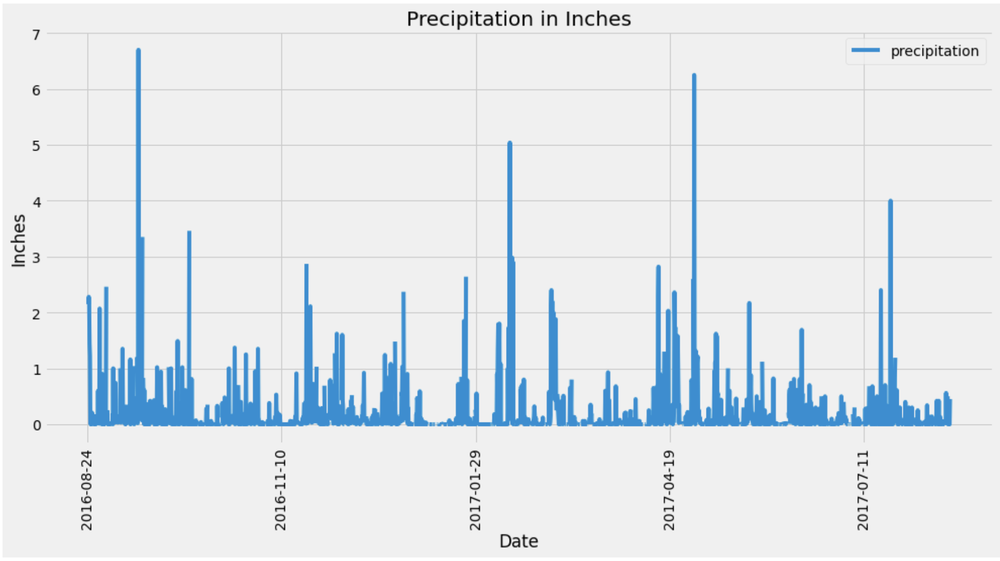
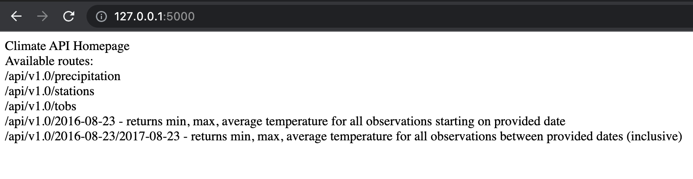
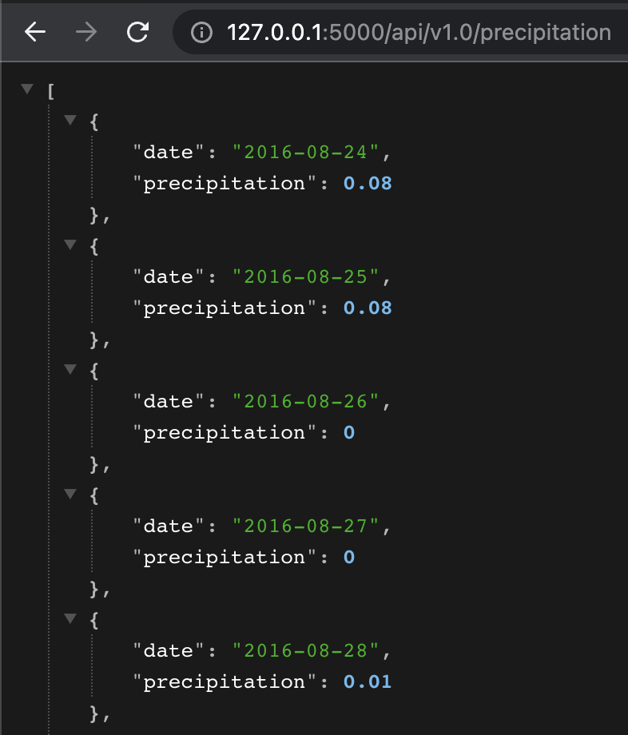
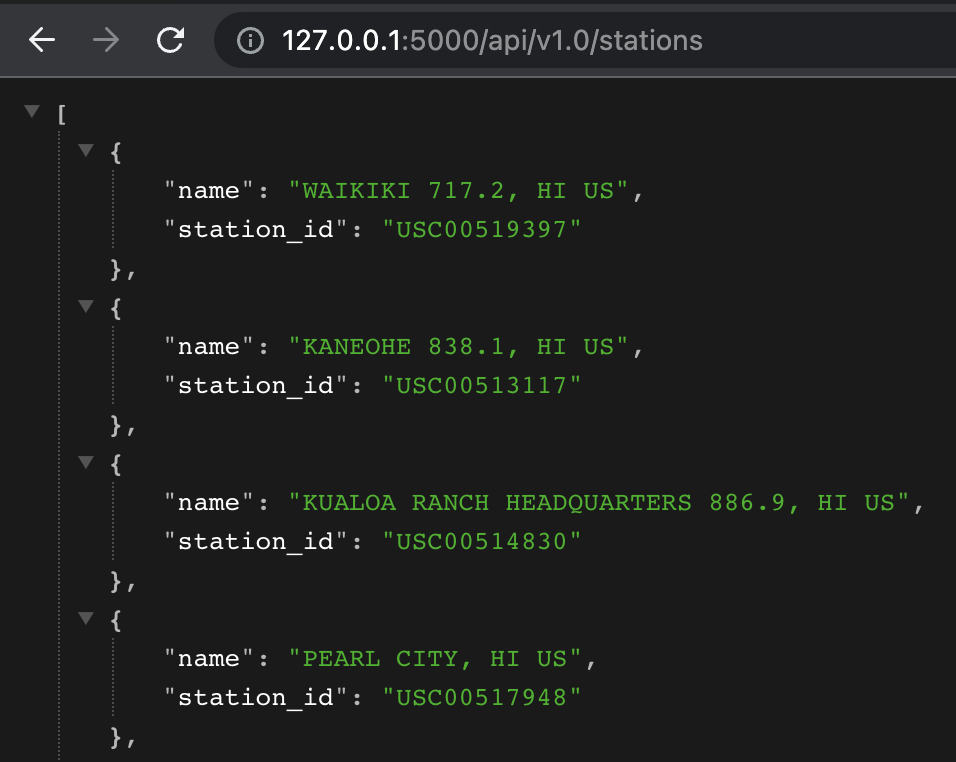
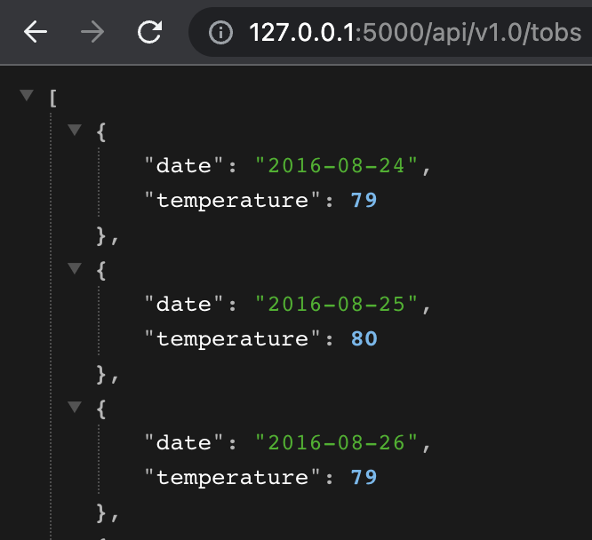
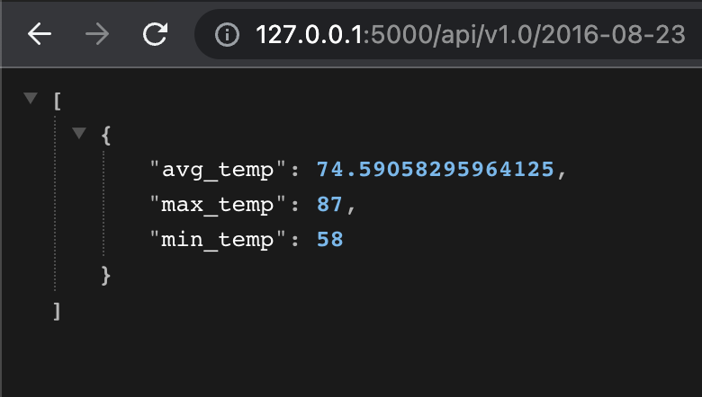
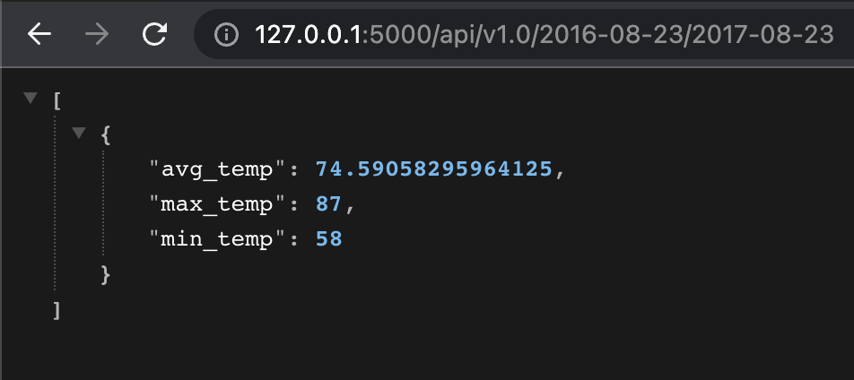
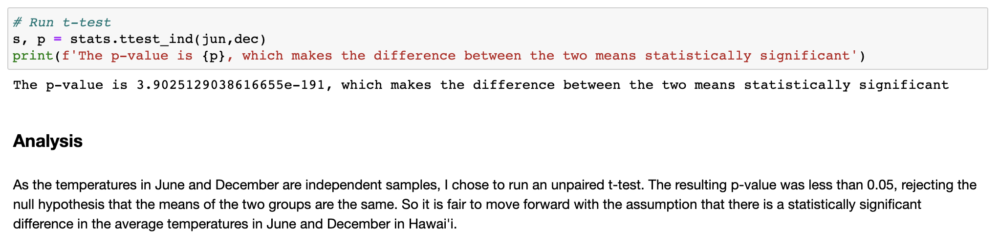
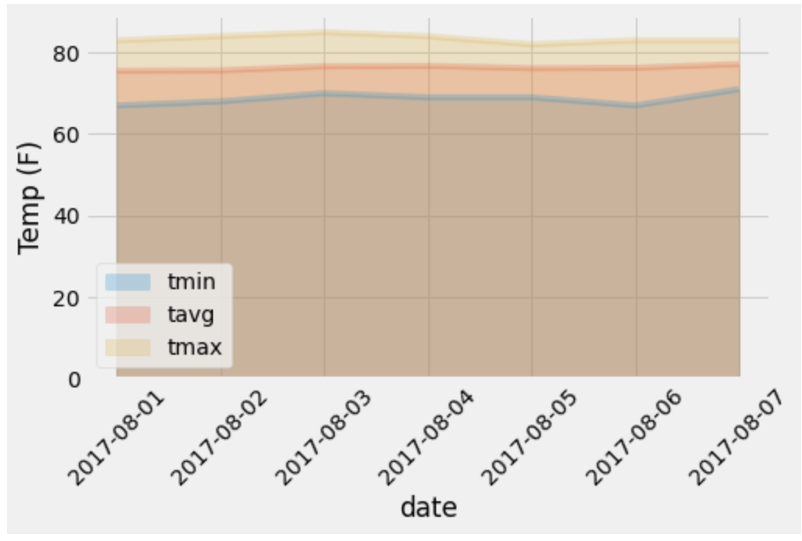

# Climate Analysis

## Exploration
This project was to explore and analyze weather data from Hawai'i. The first step was exploring the datasets in a Jupyter notebook to better understand the data and answer some basic questions. I used SQLAlchemy to access the data from the provided SQLLite database and create dataframes using Pandas.

Matplotlib was used to visualize the data:

## Flask App
Then, I created a Flask server to return JSON data from a variety of API endpoints.  

The first returns all of the precipitation data collected by the weather stations in the dataset:  

  

The second returns the name and ID of each station:  

The third queries the dates and temperature observations of the most active station for the previous year of data:  

  

Lastly, there are two endpoints that return the minimum, average, and maximum temperatures for a given start or start-end range:  

  

  

## Further Analysis

### Bonus 1
In this analysis, I wanter to see if Hawai'i has mild weather year round. I did this by determining if there is a statistically meaningful difference between the temperatures in June and December. I used an unpaird t-test to compare the the means of temperature data from June and December and determined that there is a statistically significant difference between the two:

### Bonus 2
In this analysis, I looked at historical temperature and precipitation data for August 1 to August 7 to determine if this would be an ideal time to take a trip to Hawai'i. Matplotlib was used to visualize the results:  

Guide to repo contents:
* `Resources` directory contains source data
* `climate.ipynb` contains climate analysis (based off of starter notebook given in the assignment)
* `app.py` is Climate App using flask   

####  BONUS
* `temp_analysis_1.ipynb` and `temp_analysis_2.ipynb` are Jupyter Notebooks based off starter notebooks given in the assignment for the two bonus questions 